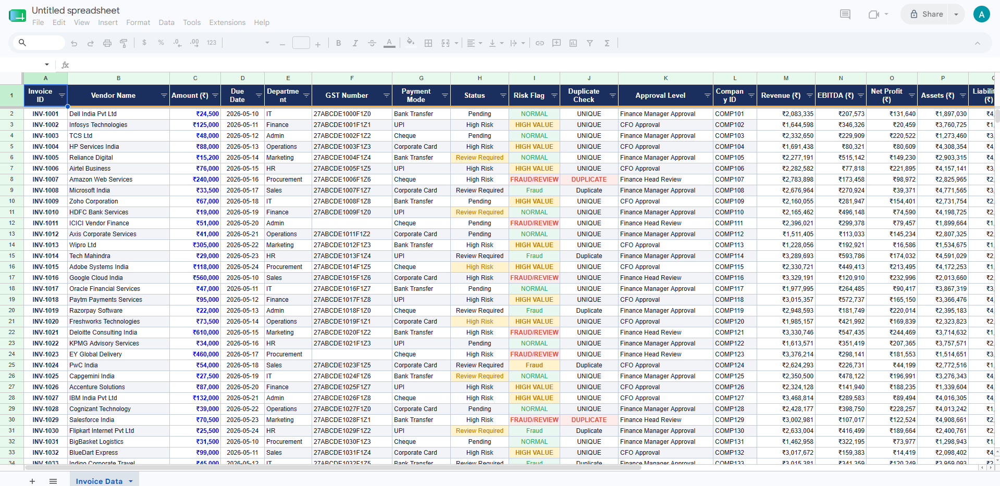
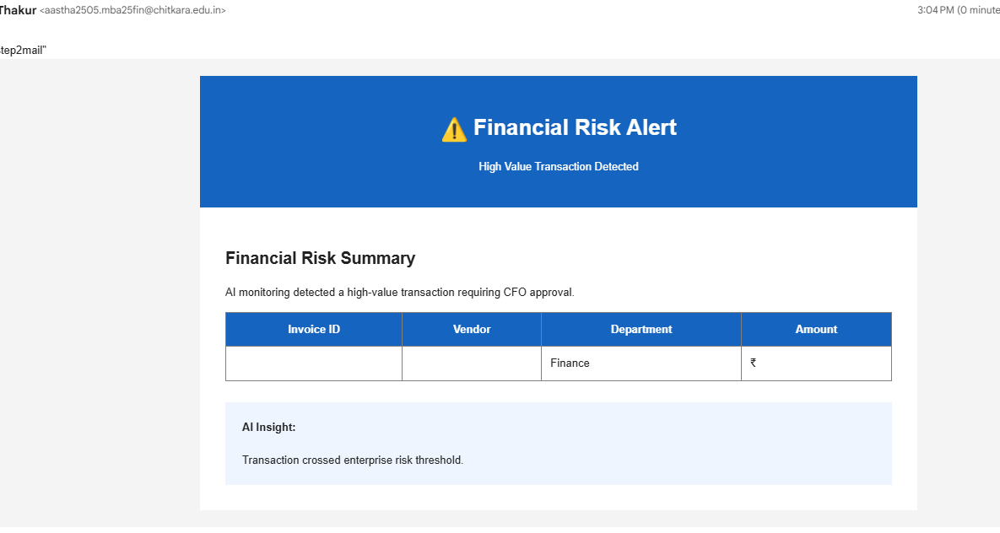
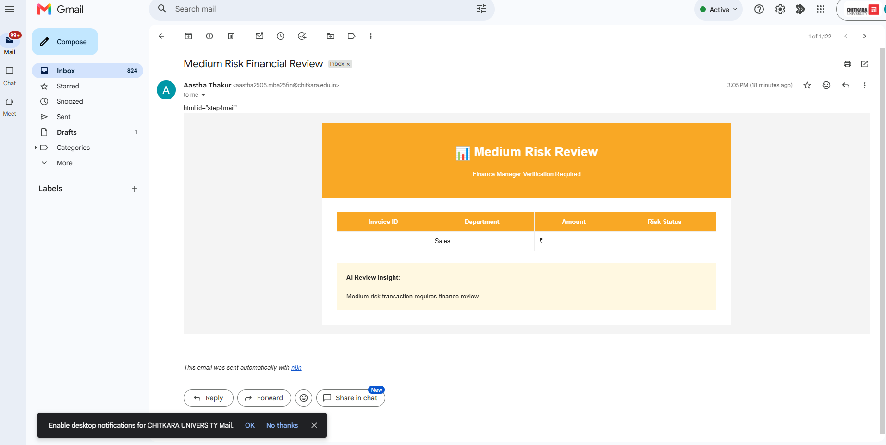

# Financial-Fraud-Automation
AI-powered fraud detection workflow using n8n for real time transaction risk scoring and alerts.
`md
# 🚨 AI-Powered Fraud Monitoring & Alert Automation using n8n

  Automated Fraud Detection • Risk Scoring • Workflow Automation • Email Alerts

---

# 📌 Project Overview

This project automates financial fraud monitoring using **n8n**, **Google Sheets**, **JavaScript**, and **Gmail**.

The workflow reads transaction data, evaluates fraud conditions using business rules, calculates a risk score, classifies transaction risk levels, updates monitoring records, and automatically sends alerts for suspicious activity.

This project simulates a modern fraud monitoring process used in financial operations and risk management.

---

# 🎯 Objectives

- Automate fraud monitoring
- Detect suspicious transactions
- Generate automated alerts
- Reduce manual review effort
- Improve operational efficiency
- Demonstrate AI + Workflow Automation

---

# 🏗️ Solution Architecture

text
Google Sheets
      ↓
Transaction Extraction
      ↓
n8n Workflow
      ↓
JavaScript Rule Engine
      ↓
Risk Scoring
      ↓
Risk Classification
      ↓
Update Dataset
      ↓
Email Notifications

---

# ⚙️ Workflow Process

### Step 1 — Read Transaction Dataset
Import transaction records from Google Sheets.

### Step 2 — Execute Fraud Logic
Apply fraud detection rules.

### Step 3 — Generate Risk Score
Assign risk score based on rule triggers.

### Step 4 — Update Monitoring Data
Store:
- Triggered Rules
- Risk Score
- Fraud Status

### Step 5 — Send Automated Alerts
Generate fraud notification emails.

---

# 🧠 Fraud Detection Rules

| Rule | Description |
|------|-------------|
| R1 | High Value Transaction |
| R2 | Round Amount Detection |
| R3 | Micro Pattern |
| R4 | Impossible Travel |
| R5 | Mule Account Pattern |
| R6 | Off Hours Activity |
| R7 | Dormant Account Spike |
| R8 | First High Value |
| R9 | Foreign Location |
| R11 | UPI Abuse |
| R12 | Cross Border Activity |

---

# 📊 Risk Classification

| Risk Score | Status |
|-----------|--------|
| 0 | CLEAR |
| 1 | LOW RISK |
| 2–3 | MEDIUM RISK |
| 4+ | HIGH RISK |

---

# 📸 Project Screenshots

## Fraud Monitoring Dataset

Shows:
- Transaction dataset
- Triggered fraud rules
- Risk score
- Fraud status

---

## 🔴 High Risk Alert

Automated alert generated for high-risk transactions.

---

## 🟠 Medium Risk Alert

Automated review notification.

---

## 🔄 n8n Workflow Automation

Workflow showing:
- Data extraction
- Fraud evaluation
- Conditional routing
- Dataset update
- Email notifications

---

# 🛠️ Tech Stack

| Technology | Purpose |
|-----------|---------|
| n8n | Workflow Automation |
| Google Sheets | Data Storage |
| JavaScript | Fraud Logic |
| Gmail | Email Alerts |
| Risk Analytics | Monitoring |

---

# 📂 Repository Structure

text
financial-fraud-automation/
│
├── README.md
├── Fraud monitoring data.json
├── assetsgoogle-sheet.png.png
├── assetshigh-risk-alert.png.png
├── assetsmedium-risk-alert.png.png
└── n8n project.png

---

# 🚀 Run Locally

### Clone Repository
